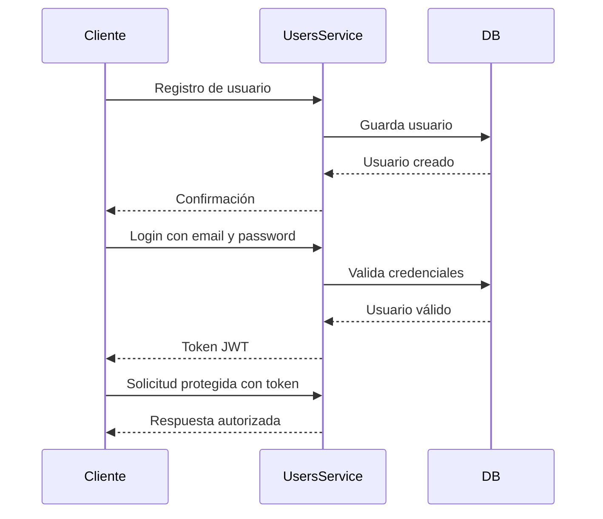

# Plan de Autenticación - SystemLibrary

## Objetivo

Implementar autenticación segura para usuarios mediante Spring Security y JWT.

## Flujo de autenticación

## Endpoints relacionados

| Método | Endpoint | Descripción |
|---|---|---|
| POST | `/api/auth/register` | Registrar usuario |
| POST | `/api/auth/login` | Iniciar sesión |
| GET | `/api/users` | Ruta protegida |

## Reglas de seguridad

- Las contraseñas deben guardarse cifradas.
- El login debe devolver un token JWT.
- Las rutas protegidas deben requerir token.
- El token debe enviarse usando `Authorization: Bearer TOKEN`.

## Mejoras futuras

- Roles de usuario.
- Refresh token.
- Recuperación de contraseña.
- Expiración configurable del token.
