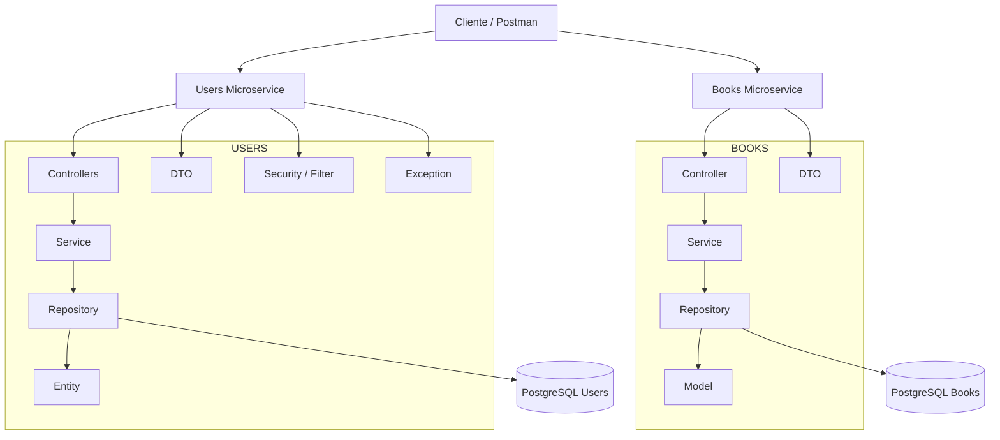

# SystemLibrary - Microservicios

Proyecto desarrollado con arquitectura de microservicios para la gestión de una biblioteca.

## Microservicios

El sistema está compuesto por dos microservicios principales:

### Users Service

Encargado de la gestión de usuarios, autenticación y generación de token JWT.

Funciones principales:

- Registro de usuarios
- Login de usuarios
- Generación de token JWT
- Validación de usuarios
- Solicitud de libros

### Books Service

Encargado de la gestión del catálogo de libros.

Funciones principales:

- Crear libros
- Listar libros
- Buscar libros por ID
- Actualizar libros
- Eliminar libros

## Tecnologías utilizadas

- Java
- Spring Boot
- Spring Web
- Spring Data JPA
- Spring Security
- JWT
- PostgreSQL
- Flyway Migration
- Docker
- Gradle

# Arquitectura Microservicios



```
