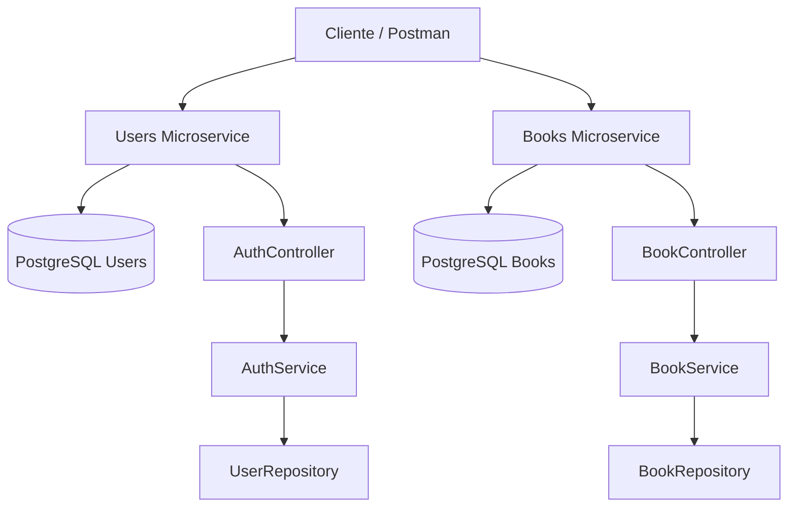

# Documentación del Proyecto - SystemLibrary

## Descripción general

SystemLibrary es un sistema desarrollado bajo arquitectura de microservicios para administrar una biblioteca. El objetivo principal es separar responsabilidades entre la gestión de usuarios y la gestión del catálogo de libros, permitiendo un sistema más ordenado, mantenible y escalable.

## Microservicios

### Users Service

Responsable de la autenticación, registro de usuarios, generación de token JWT y solicitudes de libros.

### Books Service

Responsable del mantenimiento del catálogo de libros, permitiendo crear, listar, buscar, actualizar y eliminar libros.

## Arquitectura

El sistema se divide en dos microservicios independientes:



## Capas utilizadas

Cada microservicio mantiene una estructura típica de Spring Boot:

- Controller: recibe las peticiones HTTP.
- Service: contiene la lógica de negocio.
- Repository: realiza la comunicación con la base de datos.
- Entity/Model: representa las tablas de la base de datos.
- DTO: permite transportar datos entre cliente y servidor.

## Seguridad

El microservicio `users` utiliza Spring Security y JWT para autenticar usuarios. El token generado en el login se debe enviar en las solicitudes protegidas usando el encabezado:

```http
Authorization: Bearer TOKEN
```

## Base de datos

Se utiliza PostgreSQL como motor de base de datos. Las migraciones se manejan con Flyway para mantener controladas las tablas y cambios del esquema.

## Despliegue local

Cada microservicio puede ejecutarse de forma independiente con Gradle o Docker.
